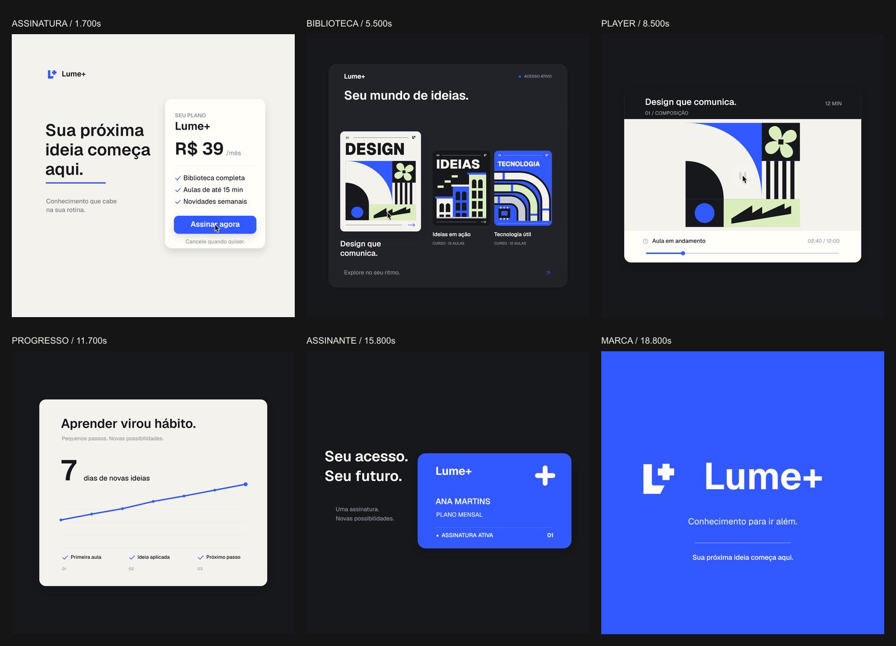

# Lume+ — GSAP refinement

A second edition of the fictional subscription product film, reviewed by four agents responsible for motion, transition continuity, illustration and typography, and rhythm and production checks. The [previous edition](LUME.md) remains available.

[Watch or download the refined film](docs/lume-refined/lume-refined-1440-60.mp4) · 22 seconds · 1440 × 1440 · 60 fps.



## What changed

- The subscription card folds behind the growing course cover. The opening retains its context during the handoff.
- One opaque band carries the course title from the library into the player. Horizontal text placement finishes before the two lines join.
- The lesson demonstrates composition: a circle develops into a curve, the bloom rotates, columns grow and the staircase resolves. The play overlay leaves the artwork after the press.
- An opaque curtain carries the progress screen upward. Its heading and counter enter after clearing the moving timeline.
- Every chart node follows the same transformation as the line. The line lands as the horizontal stroke of the shared plus symbol.
- The membership name and plan arrive together; the active status finishes appearing at the confirmation chime, 14.30 seconds.
- Color floods and shape morphs have separate roles at the ending. The blue button resolves before its label; masked headings return inside the frame.

## GSAP and rendering

[GSAP 3.15.0](https://github.com/greensock/GSAP) is installed from the official GitHub archive, pinned to revision `13e2b790546426a1a2e0e9b409f3f8dc6d6611f2`. Core and three official plugins are copied locally, with retained license headers and [file hashes](public/assets/gsap/provenance.json).

`CustomEase` supplies monotone travel and settling curves. `MotionPathPlugin` routes the shared surface and cursor. `MorphSVGPlugin` interpolates the plus, L+ mark and returning button paths drawn with Canvas Path2D. There are no springs or bouncing overshoots.

The paused master timeline in [lume-motion.js](public/lume-motion.js) evaluates camera position, logarithmic zoom, surface dimensions and cursor contact. The renderer in [lume-refined.js](public/lume-refined.js) resets Canvas drawing state and seeks from time. Fonts, images and vendor scripts load once before rendering. Playback clocks belong to the preview, not the frame function.

The Remotion composition is **LumeRefined**. Its single canvas uses the same engine as the Playwright exporter. Production averages four temporal samples per frame and twelve in the six camera travel windows, with an exposure of 0.42 frame. Time wraps naturally at the endpoints; no endpoint frame is copied over another.

## Rhythm and media

The existing soundtrack is preserved: **Deep Urban — Eugenio Mininni**, from [Mixkit's house catalog](https://mixkit.co/free-stock-music/house/), retimed to 120 BPM. The opening is filtered before the 3.30-second musical entrance. Interface clicks, two confirmation chimes and short transition effects support the gestures.

Measured musical attacks fall within 8 ms of the main gesture starts. The visual landing occurs later, at the end of each authored movement. The membership confirmation now lands on its 14.30-second chime. Audio sources, downloads, mixing and [Mixkit licenses](https://mixkit.co/license/) are documented in [LUME.md](LUME.md).

The course covers and lesson artwork are original vectors in [lume-refined-art.js](public/lume-refined-art.js). Geist, Lucide and the existing macOS style pointer retain the provenance in [ASSETS.md](ASSETS.md). GSAP has its own [Standard License](https://gsap.com/standard-license/).

## Reproduce

Requires Node.js, FFmpeg, ffprobe and Microsoft Edge.

```sh
npm ci
node scripts/lume-vendors.cjs
node scripts/lume-audio.cjs
node scripts/server.cjs 4187
```

Open [the browser preview](http://127.0.0.1:4187/lume-refined.html). In another terminal:

```sh
node scripts/lume-refined-produce.cjs stills
node scripts/lume-refined-produce.cjs compare
node scripts/lume-refined-produce.cjs critical
node scripts/lume-refined-motion-check.cjs
node scripts/lume-refined-produce.cjs audit
node scripts/lume-refined-produce.cjs render
node scripts/lume-refined-final-check.cjs
```

`critical` captures eight transition moments and 104 nearby source frames. These contacts need a visual review; capture coverage alone is not approval. The additional player-to-progress review inspects 36 consecutive frames from 9.25 to 9.833 seconds.

Output: `out/lume-refined/lume-refined-1440-60.mp4`. Run `npm run dev` and select **LumeRefined** for Remotion Studio.

## Validation evidence

The source audit scans all 1,320 frames for isolated jumps and compares 48 full-resolution seek replays. Opening and closing source frames match exactly across 1440 × 1440 RGBA pixels. Independent motion checks cover 285 timeline comparisons, 1,321 valid poses, seven cold canvas replays and 48 additional full canvas replays. Remotion frame 510 matches the browser canvas pixel for pixel. The canvas requests CPU rasterization from creation so early pixel readbacks cannot change its rendering backend.

The encoded MP4 is decoded and scanned separately: **1440 × 1440, 60 fps, 1,320 frames, 22.000 seconds**, H.264/AAC. All 1,320 decoded frames were scanned with **zero isolated jump candidates**. Finished audio measures **−14.03 LUFS / −1.71 dBTP**. Source-pixel equality does not imply identical decoded pixels after H.264 compression; the encoded endpoint thumbnails differ by a mean 0.0531 and a maximum 3 channel levels.

- [Source preflight](docs/lume-refined/preflight.json)
- [Production frame scan](docs/lume-refined/frame-scan.json)
- [Decoded video scan](docs/lume-refined/encoded-scan.json)
- [Encoded audio measurement](docs/lume-refined/loudness.json)
- [Motion audit](docs/lume-refined/motion-audit.json)
- [Independent motion and cold canvas check](docs/lume-refined/motion-check.json)
- [Transition review](docs/lume-refined/transition-review.json)
- [Rhythm review](docs/lume-refined/rhythm-review.json)
- [Remotion comparison](docs/lume-refined/remotion-check.json)
- [Critical contacts](docs/lume-refined/critical.png)
- [Before and after, part 1](docs/lume-refined/compare-01.png)
- [Before and after, part 2](docs/lume-refined/compare-02.png)
- [Player to progress, 36 consecutive frames](docs/lume-refined/player-progress-review.png)

Lume+, its price, courses, member and metrics are illustrative. The previous edition and original Forma and Órbita films are retained.
