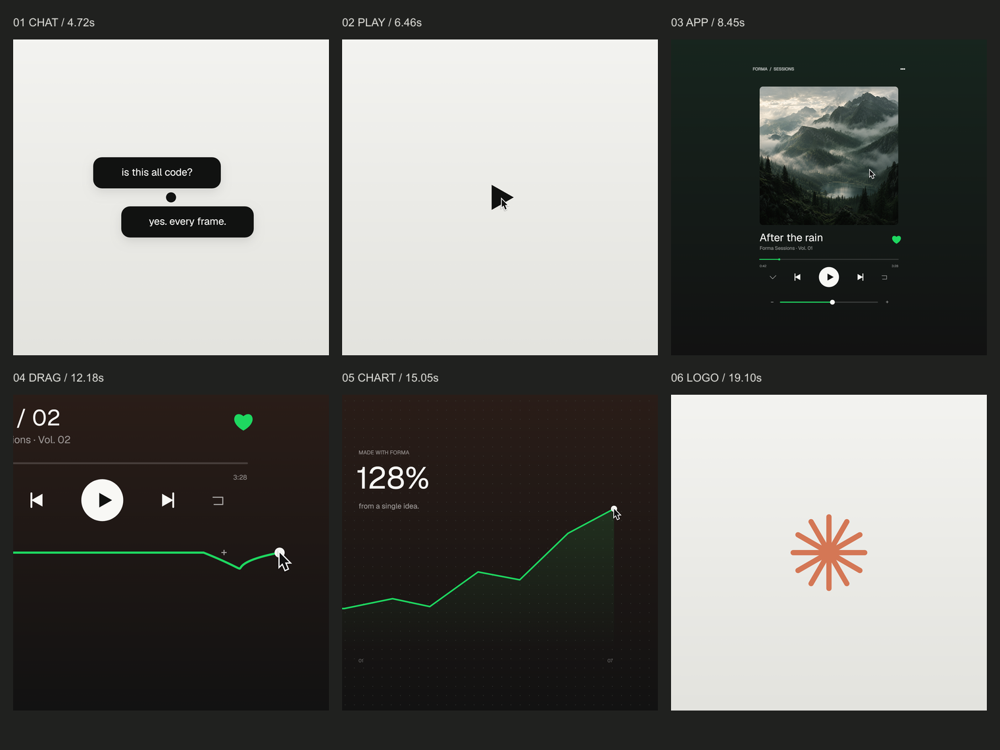

# Forma — every frame

A continuous 22-second motion study for a fictional creative product. A Generate button becomes a conversation, a music player, a volume control, a chart and a radial mark, before returning to its opening frame.

**1440 × 1440 · 60 fps · 1320 frames · 2D canvas · Remotion 4.0.531**

[Download the finished MP4](docs/forma-loop-1440-60.mp4)

Export verified: 22.000 seconds, 1320 frames, H.264/AAC, −14.0 LUFS integrated loudness. The frame scan found no isolated jump candidates; first and last source-frame hashes match. See [frame scan](docs/frame-scan.json) and [loudness report](docs/loudness.txt).



## Run

Requires Node.js, FFmpeg on PATH and Microsoft Edge. For another browser, change the Playwright `channel` in the scripts.

```sh
npm ci
node scripts/download-audio.cjs
node scripts/audio.cjs
npx remotion studio --no-open
```

Open the Studio URL printed by Remotion and select **Forma**.

## Export with motion blur

Start the deterministic canvas preview in one terminal:

```sh
node scripts/server.cjs
```

Then, in another terminal:

```sh
node scripts/stills.cjs
node scripts/render.cjs
```

The finished file is `out/forma-loop-1440-60.mp4`. The custom Playwright exporter samples the same `seek(t)` canvas used by the Remotion composition, with four temporal samples per frame, twelve during the fast pan, and a 180-degree shutter. It writes a frame-difference report and verifies the first/last image hashes. The final video uses H.264 and AAC. This export route is used to implement the requested custom supersampling; the ordinary Remotion renderer is also supported but does not add this custom blur.

```sh
npx remotion render Forma out/forma-direct.mp4
```

## Implementation

- `public/engine.js`: all scene geometry and drawing; deterministic seek, log-space camera, side-by-side world positions, offscreen blur/alpha-threshold goo and circular floods.
- `src/Root.tsx`: Remotion composition and synchronized soundtrack.
- `scripts/audio.cjs`: pitch-preserving music retime, low-pass intro, SFX peak alignment and loudness processing.
- `scripts/render.cjs`: Playwright export, motion blur and adjacent-frame scan.
- `BEAT-MAP.md`: timing and audio-edit notes.
- `ASSETS.md`: provenance, licenses and the original image prompts.

The counter uses discrete whole values. Forma and its sample metrics are fictional. Artwork was generated with the built-in image tool; the ending mark is canvas geometry.

## Media and licenses

Head Bang by Arulo and the effects are from [Mixkit](https://mixkit.co/license/). The isolated source audio and mixed WAV are not distributed in this repository; the setup script obtains them for local production. Geist is under the SIL Open Font License. The macOS-style cursor is from [ful1e5/apple_cursor](https://github.com/ful1e5/apple_cursor), with its GPL-3.0 license included. Remotion has its own [license terms](https://www.remotion.dev/license).
