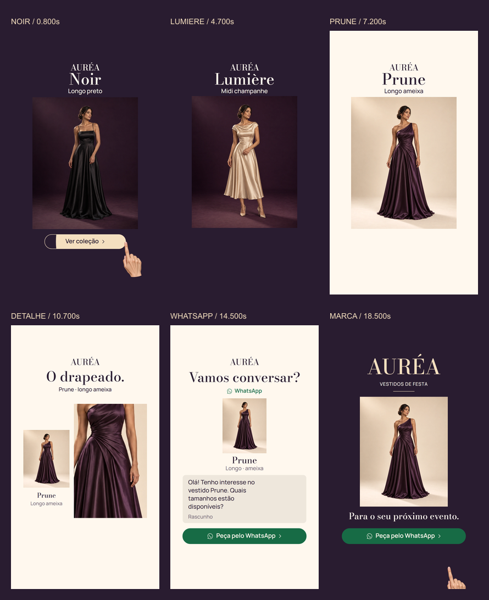
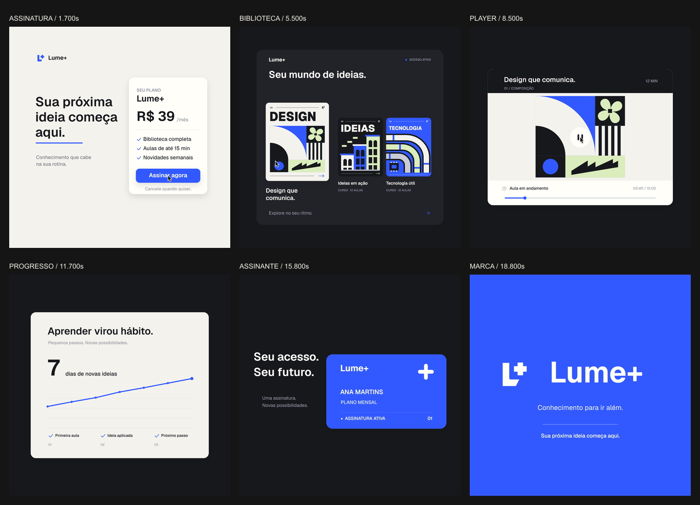
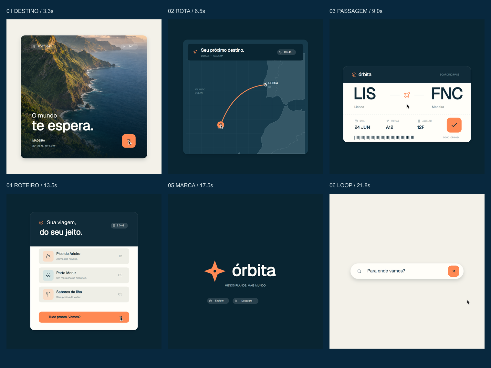

# Forma — every frame

## Latest edition: AURÉA — occasion dresses

**[AURÉA — photographic hand edition](AUREA.md)** is a fictional evening-dress boutique film with centered photographs, titles and buttons, Bodoni Moda and Manrope, and a continuous GSAP camera. A photographic hand generated with builtin imagegen touches the liquid button and swipes the photographs; its measured fingertip stays attached until release. The hand has no forearm. The selected dress leads into its fabric crop and a centered WhatsApp draft. The signature underline becomes the centered opening button to close the loop.

**22 seconds · 1080 × 1920 · 60 fps · 1,320 frames.** [Watch or download](docs/aurea/aurea-photohand-1080x1920-60.mp4). [Storyboard](docs/aurea/storyboard.png). [Hand before/after](docs/aurea/hand-comparison.png). [Generation prompts](docs/aurea/generated-hand-prompts.md).

Four reviewers covered art, garment integrity and commercial copy, motion, and audio. Source and encoded-video evidence, font/media provenance and reproduction commands are linked in [AUREA.md](AUREA.md). The brand and photographs are illustrative; no operational phone number or message sending is represented.

```sh
npm ci
node scripts/aurea-audio.cjs
node scripts/server.cjs 4187
```

Open `http://127.0.0.1:4187/aurea.html`, or select **Aurea** in Remotion Studio. The mixed WAV is generated locally and excluded from Git; the finished MP4 includes the soundtrack.



## Previous edition: Lume+ with GSAP

**[Lume+ — refined edition](LUME-REFINED.md)** improves the continuous transitions with an opaque title carrier, a developing lesson illustration, a traveling progress mask and a chart that resolves into the shared brand symbol. Four reviewers covered motion, continuity, drawing and typography, and rhythm.

[Watch or download the refined film](docs/lume-refined/lume-refined-1440-60.mp4) · 22 seconds · 1440 × 1440 · 60 fps.

Built with official GSAP CustomEase, MotionPath and MorphSVG, pinned from GitHub. Reproduction, visual comparisons and source/encoded validation reports are in [LUME-REFINED.md](LUME-REFINED.md).

The opening now starts with a blue outlined CTA that fills with liquid from the pointer's entry point. Its label changes color through the same mask, and the fill recedes at the ending to restore the initial frame. [Hover preview](docs/lume-refined/cta-hover.png).


## Previous edition: Lume+

**[Lume+ — subscription product film](LUME.md)** follows a fictional learning subscription through its course library, lesson player, progress and membership card. Original vector covers, a continuous camera and the shared L+ mark connect the interface in a 22-second loop.

[Watch or download Lume+](docs/lume/lume-1440-60.mp4) · 1440 × 1440 · 60 fps. Music: Deep Urban — Eugenio Mininni, with interface effects from [Mixkit](https://mixkit.co/license/).

Verified 22.000 seconds and 1,320 frames. Source endpoints match exactly; the source and decoded-video scans found no isolated jump candidates. Finished audio: −14.03 LUFS / −1.71 dBTP. Reproduction and evidence are in [LUME.md](LUME.md).



## New edition: Órbita

**[Órbita — seu próximo destino](ORBITA.md)** now includes original vector travel illustrations, a staged boarding-pass confirmation, an opaque photo-to-map reveal and a compass that becomes the search field. The latest refinement uses measured musical attacks and contributions from GPT-6 Astra. The original Forma video remains below.

[Download Órbita — refined edition MP4](docs/orbita/orbita-refined-1440-60.mp4) · 22 seconds · 1440 × 1440 · 60 fps.



## Original edition: Forma

A continuous 22-second motion study for a fictional creative product. A Generate button becomes a conversation, a music player, a volume control, a chart and a radial mark, before returning to its opening frame.

**1440 × 1440 · 60 fps · 1320 frames · 2D canvas · Remotion 4.0.531**

[Download the finished MP4](docs/forma-loop-1440-60.mp4)

Export verified: 22.000 seconds, 1320 frames, H.264/AAC, −14.0 LUFS integrated loudness. The frame scan found no isolated jump candidates; first and last source-frame hashes match. See [frame scan](docs/frame-scan.json) and [loudness report](docs/loudness.txt).


## Run

Requires Node.js, FFmpeg on PATH and Microsoft Edge. For another browser, change the Playwright `channel` in the scripts.

```sh
npm ci
node scripts/download-audio.cjs
node scripts/audio.cjs
npx remotion studio --no-open
```

Open the Studio URL printed by Remotion and select **Forma**.

## Export with motion blur

Start the deterministic canvas preview in one terminal:

```sh
node scripts/server.cjs
```

Then, in another terminal:

```sh
node scripts/stills.cjs
node scripts/render.cjs
```

The finished file is `out/forma-loop-1440-60.mp4`. The custom Playwright exporter samples the same `seek(t)` canvas used by the Remotion composition, with four temporal samples per frame, twelve during the fast pan, and a 180-degree shutter. It writes a frame-difference report and verifies the first/last image hashes. The final video uses H.264 and AAC. This export route is used to implement the requested custom supersampling; the ordinary Remotion renderer is also supported but does not add this custom blur.

```sh
npx remotion render Forma out/forma-direct.mp4
```

## Implementation

- `public/engine.js`: all scene geometry and drawing; deterministic seek, log-space camera, side-by-side world positions, offscreen blur/alpha-threshold goo and circular floods.
- `src/Root.tsx`: Remotion composition and synchronized soundtrack.
- `scripts/audio.cjs`: pitch-preserving music retime, low-pass intro, SFX peak alignment and loudness processing.
- `scripts/render.cjs`: Playwright export, motion blur and adjacent-frame scan.
- `BEAT-MAP.md`: timing and audio-edit notes.
- `ASSETS.md`: provenance, licenses and the original image prompts.

The counter uses discrete whole values. Forma and its sample metrics are fictional. Artwork was generated with the built-in image tool; the ending mark is canvas geometry.

## Media and licenses

Head Bang by Arulo and the effects are from [Mixkit](https://mixkit.co/license/). The isolated source audio and mixed WAV are not distributed in this repository; the setup script obtains them for local production. Geist is under the SIL Open Font License. The macOS-style cursor is from [ful1e5/apple_cursor](https://github.com/ful1e5/apple_cursor), with its GPL-3.0 license included. Remotion has its own [license terms](https://www.remotion.dev/license).
